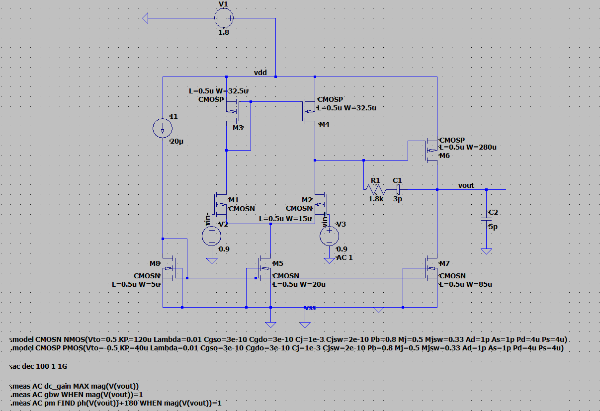
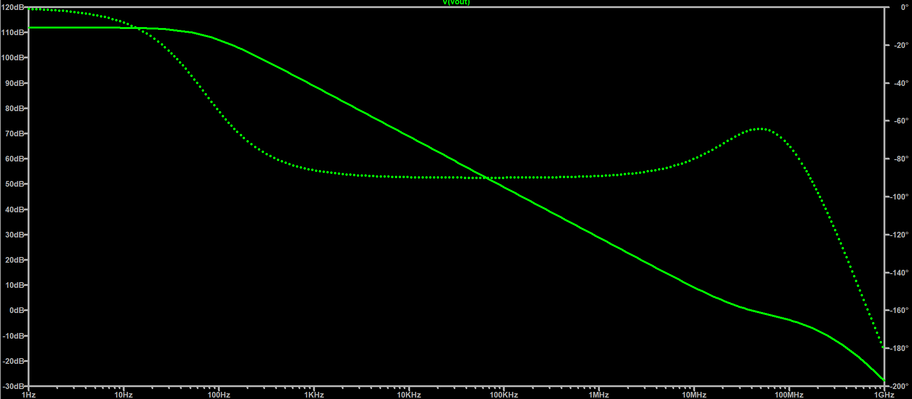

# Two-Stage CMOS Op-Amp with Miller Compensation

Transistor-level design and simulation of a two-stage CMOS operational
amplifier in LTspice using 180 nm-equivalent MOS models.

The design consists of an NMOS differential input stage with PMOS
active load, a common-source second stage, and Miller compensation
with a series nulling resistor.

## Schematic

## Simulation Results

| Parameter | Result |
|---|---:|
| DC Gain | 111.90 dB |
| GBW | 40.78 MHz |
| Phase Margin | 41.25° |
| Supply | 1.8 V |
| Bias Current | 20 µA |
| Load Capacitance | 5 pF |
| Miller Capacitor | 3 pF |
| Nulling Resistor | 1.8 kΩ |

## Transistor Sizing

| Device | Function | W/L |
|---|---|---:|
| M1, M2 | Differential pair | 30 |
| M3, M4 | PMOS active load | 65 |
| M5 | Tail current source | 40 |
| M6 | Second-stage gain transistor | 560 |
| M7 | Second-stage current sink | 170 |
| M8 | Bias transistor | 10 |

All devices use L = 0.5 µm.

## Compensation

Miller compensation is implemented using:

- Cc = 3 pF
- Rz = 1.8 kΩ

The compensation network is used to control pole splitting and the
associated compensation zero.

## Simulation

LTspice was used for DC operating-point and AC frequency-response
analysis.

The AC sweep is performed from 1 Hz to 1 GHz with 100 points/decade.

Error Analysis

The simulated results were compared against the initial design targets to identify the main performance gaps.

Parameter	Target	Simulated	Deviation
DC Gain	≥ 75 dB	111.90 dB	+36.90 dB
GBW	≈ 50 MHz	40.78 MHz	−18.44%
Phase Margin	≥ 60°	41.25°	−18.75°
Bias Current	20 µA	20 µA	0%

The DC gain exceeds the target substantially, while the GBW and phase margin remain below the initial specifications. The reduced bandwidth and phase margin are primarily associated with the locations of the dominant and non-dominant poles and the compensation zero introduced by the Miller network.

The results are also sensitive to the simplified MOSFET models used in the simulation. Since the design does not include a foundry PDK, process variation, device mismatch, or extracted layout parasitics, the simulated values should be treated as nominal circuit-level results rather than silicon-accurate specifications.

Further optimization will focus on the compensation capacitor, nulling resistor, second-stage bias current, and transistor sizing to improve the GBW–phase-margin trade-off.
